# 首次使用的必要配置

### 一 Eclipse 安装

将 Eclipse 解压或安装到 **没有中文** 且 **没有空格** 的路径下

### 二 Workspace 设置

#### 1 选择工作空间

首次启动，选择工作空间（workspace），用于存放 Java 代码

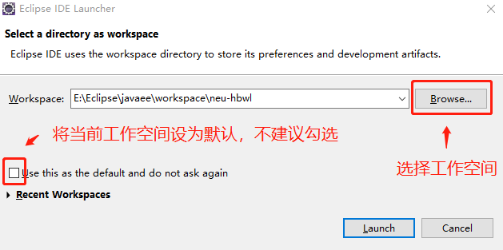

Use this as the default and do not ask again 选项，如果勾选，则将当前工作空间设为默认工作空间，每次启动 Eclipse 自动进入该工作空间，不方便开启其它 Workspace。

#### 2 欢迎页

首次进入工作空间，会有如下欢迎页，可以取消勾选页面右下角的选项，避免每次启动都显示

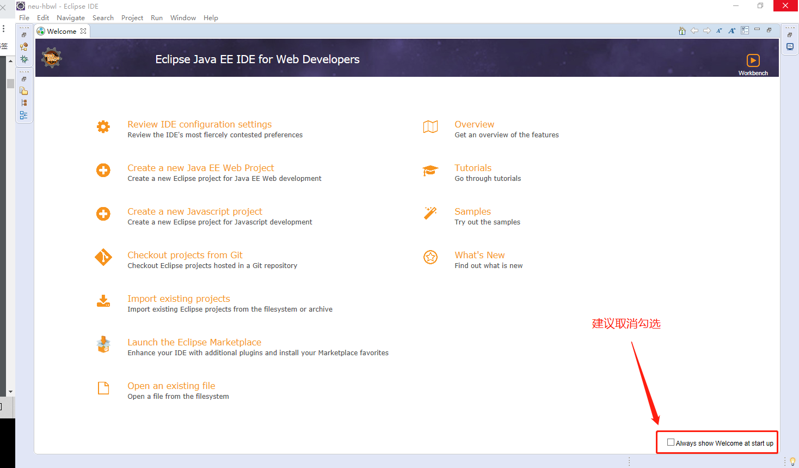

### 三 设置透视图（perspective）

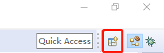

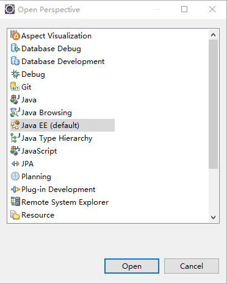

### 四 添加透视图需要显示的 View

#### 1 Package Explorer

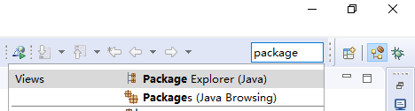

#### 2 Navigator

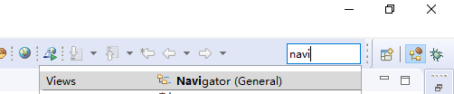

#### 3 Outline

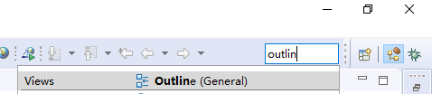

#### 4 Console

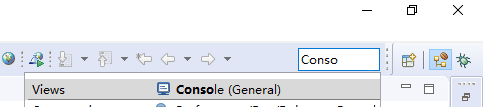

建议将 Package Explorer、Navigator、Outline 统一放置于左侧

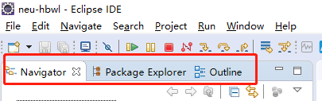

### 五 关闭不需要的 View

* Project Explorer
* Markers
* Properties
* Date Source Explorer
* Snippets
* Task List

以上面板不常用，可以删除

### 六 编码集

Window -> Preferences -> General -> Workspace

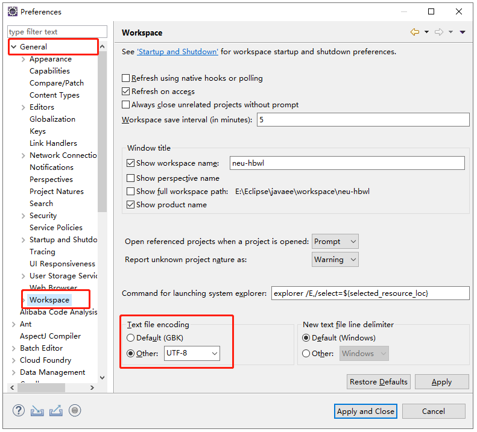

### 七 字体

Window -> Preferences -> General -> Appearance -> Colors and Fonts

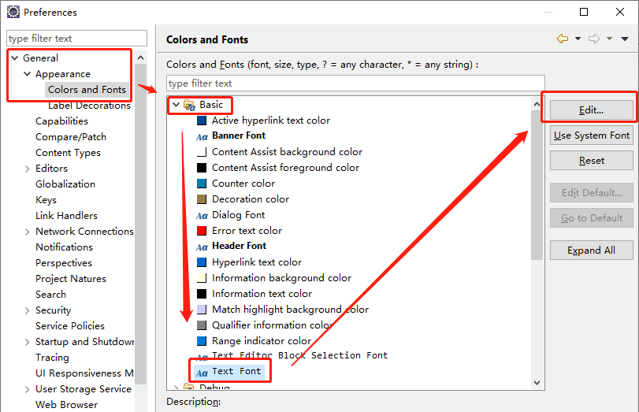

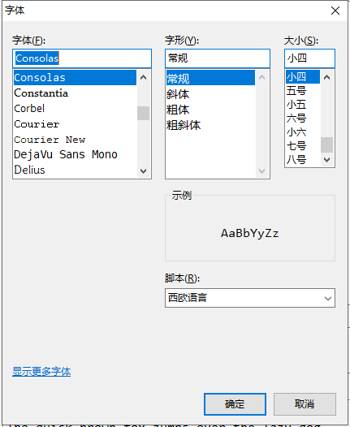

### 八 设置 package explorer 中右键 new 菜单

Windows -> Perspective -> Customize Perspective... -> Menu Visibility -> File -> New

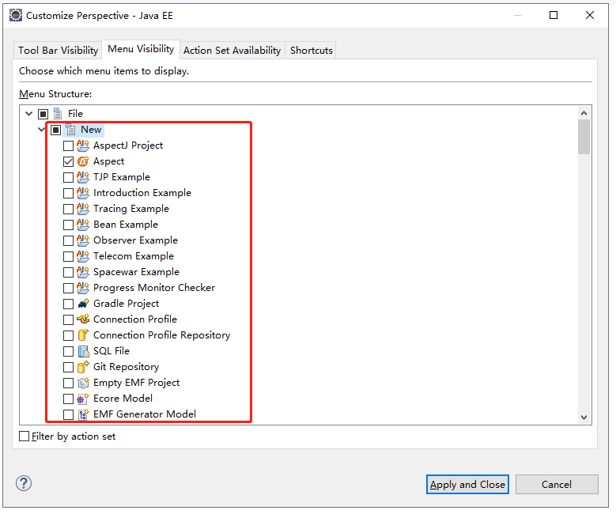

取消 New 选项卡选择，从子列表中选择常用的结构即可。参考选项：

* Java Project
* Package
* Class
* Interface
* Enum
* Annotation
* JUnit Test Case
* Folder
* File
* JSP File
* Dynamic Web Project
* Servlet
* Filter
* HTML File
* Static Web Porject
* XML File

### 九 保存当前透视图

Window -> Perspective -> Save Perspective As... 

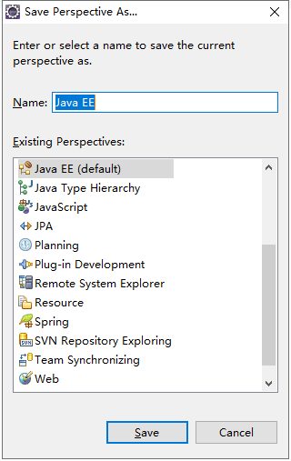

