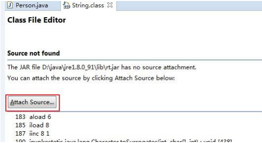

# 常见问题

### 一 无法正常启动

无法启动的原因有很多种，可以从如下几个方面排查

* 环境变量是否配置正确，可在命令行输入 java 或 javac 验证
* 是否正确安装 JDK、JRE
* JDK 的版本（32位还是64位）需要与 Eclipse 版本一致
* 修改 Eclipse 安装目录下的 eclipse.ini 配置文件

### 二 启动 Eclipse 无可选的 Workspace

**原因**

勾选了下图中 Use this as the default and do not ask again


**解决方案**

Window -> Preferences


### 三 工程中的代码有乱码

**原因**

出现乱码的代码所使用的字符编码集与工程使用的字符编码集不一致导致

**解决**

修改乱码文件的字符集编码即可

### 四 新建 Workspace，之前的设置没了

原因

对 Eclipse 的设置，仅对当前使用的 workspace 有效。设置的数据保存在对应 workspace 文件夹下的  .metadata 文件夹中。如果创建了新的 workspace，则需要重新设置

### 五 如何在 Eclipse 中查看 Java 类库源代码

在代码中，Ctrl + 左击 查看指定类，可以调出如下界面



点击 Attach Source...


要导入的源码如果以文件方式存在，则选择：External File

要导入的源码如果以文件夹方式存在，则选择：External Folder

要导入的源码如果以 src.zip 存在，则选择：External File

### 六 如何在编写的代码中显示作业的相关信息

Window -> Preferences -> Java -> Code Style -> Code Templates

**Comments -> Types**

````
/**
 * <p>Description：</p>
 * <p>变更说明：guoteng ${date}  ...</p>
 * @author 		guoteng	Email:guoteng@neusoft.com
 * @Date 		${date}
 * @version		1.0
 */
````

**Comments -> Methods**

````
/**
 * <p>Description：</p>
 * @author	guoteng	Email:guoteng@neusoft.com
 * @Date	${date}
 * ${tags}
 */
````

